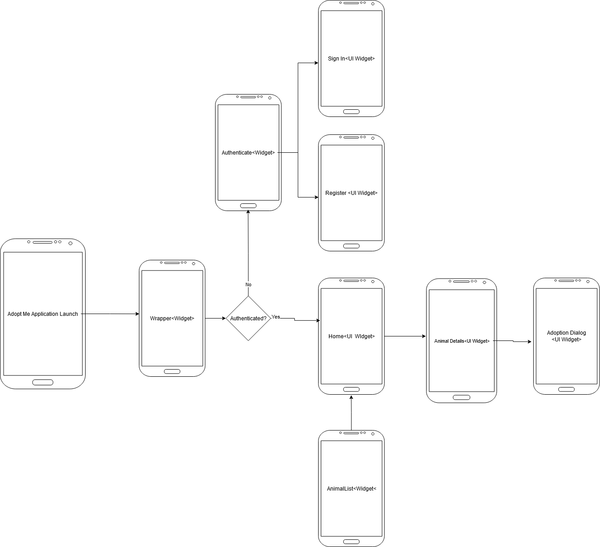
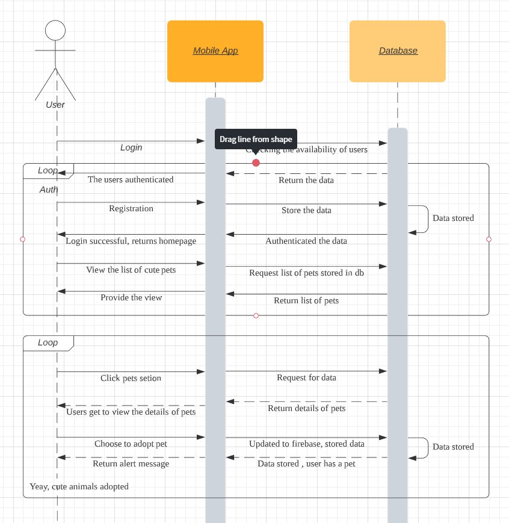

# flutter-adoptMe-
A flutter mobile application that lets you adopt cute cats! Made for INFO 4303 Mobile App Dev Class.

# Title

## Adopt Me! Mobile Application

**Group Bayan**
 **Muhammad Kamiel bin Samsudin 1713493**
 **Muhammad Adib bin Mohd Zafrullah 1726359** 

 # Introduction

This mobile application is developed to help people adopt cute animals in their area! All animals are equal, but some are more equal than others.

# Objective

Our mobile application is designed to help users in the local area to adopt cute animals. There are lots of animals who don't have a place to call home, and live in the streets. We aim to help reduce the homeless animal population as well as giving the animals loving homes, and the people with loving pets.

# Features

 - Login and Register with Email and Password Authentication
 - Viewing a List of Animals
 - Viewing the details of the Animals
 - Adopting the animals

**Buggy Features that are to be implemented**
 - Viewing the animals that a user has adopted
 - Not allowing an adopted animal to be adopted by another user.

# Screen Navigation

The navigation of the application is a bit convoluted. First we have a wrapper widget which will return either homepage or 
sign in, depending on the user's authentication state. Once a user has signed in, the authentication state changes, and the homepage will be displayed. From the homescreen, a user can view a list of animals or logout. The user can choose a specific animal on the list and it will return the animals details. In the details page, the user can view the animal details and choose to adopt it!

# Sequence Diagram

# Task Distribution

## Muhammad Kamiel
 
 Developed the connection widgets to Firestore, FireBase Authentication, and FireBase Storage.
 Developed the business logic components regarding authentication, database, and registering and signing up.
 
 ## Adib
 
Developed and composed the UI widgets throughout the mobile application. In charge of linking and navigating the various UI components. In charge of processing and handling the data retrieved from Firestore.

# References

### **Firebase plugins and packages**
https://firebase.flutter.dev/
### **Loading animations**
https://pub.dev/packages/loading_animations
### **Tutorials and Explanation (Credits to thenetninja!)**
https://www.youtube.com/watch?v=sfA3NWDBPZ4&list=PL4cUxeGkcC9j--TKIdkb3ISfRbJeJYQwC
### **Firestore CRUD operations**
https://petercoding.com/firebase/2020/04/04/using-cloud-firestore-in-flutter/
